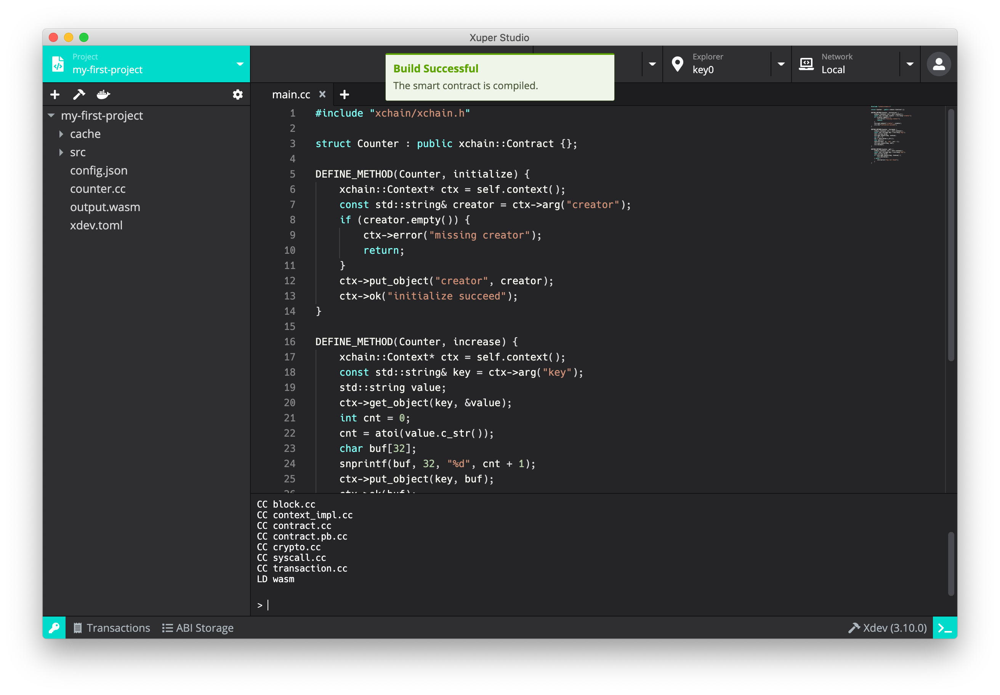

# XuperIDE 使用文档

XuperIDE 是一个帮助开发者快速开发[百度超级链](https://xuper.baidu.com/)智能合约的集成化开发环境。

## 安装

### 下载

目前 XuperIDE 支持 macOS, Linux 和 Windows 操作系统，对应的安装包可以在下方地址进行下载（[macOS](https://app.obsidians.io/xuper/mac), [Linux](https://app.obsidians.io/xuper/linux), [Windows](https://app.obsidians.io/xuper/win)）。

### 安装

- **macOS**: 双击打开 `XuperIDE-x.x.x.dmg` 并将 `XuperIDE` 拖动到应用文件夹内（初次运行时若出现未通过苹果验证的提示，可右键点击应用图标并打开，跳过验证）。
- **Linux**: 双击打开 `XuperIDE-x.x.x.AppImage`, 选择 *Properties* => *Permissions* => *Execute*, 将 *Allow executing file as progrom* 选项打勾。关闭属性设置窗口并双击打开应用（不同的 Linux 发行版可能会有不同的安装方式）。
- **Windows**:  双击 `XuperIDE-x.x.x.exe`，安装并打开应用。

## 功能预览

### 准备工作

在正确安装 XuperIDE 并初次启动时，你将看到一个欢迎页面，这里有 XuperIDE 正常运行所需要的依赖，包括了 Docker，Xuperchain node 及 Xdev

  

- XuperIDE 使用 [**Docker**](https://www.docker.com/) 来启动 Xuper 节点和进行项目编译。如果你之前没有安装过 Docker，可以点击 *Install Docker* 按钮访问 Docker 官方网站并进行下载安装；
  - 对于 Windows 用户，我们推荐使用 [Docker Desktop](https://www.docker.com/products/docker-desktop)。[Docker Toolbox](http://docs.docker.oeynet.com/toolbox/toolbox_install_windows/) 也可使用，但在一些情况可能会出现问题；
- [**Xuperchain node**](https://hub.docker.com/repository/docker/obsidians/xuperchain) 是超级链节点的 Docker 镜像，XuperIDE 使用这个镜像来运行 Xuperchain 节点；
- [**Xdev**](https://hub.docker.com/r/xuper/xdev) 是超级链 C++ 合约的开发及编译工具。

当所有依赖都正确安装并运行后，灰色的 *Skip* 按钮将会变成绿色的 *Get Started* 按钮。点击这个按钮进入 XuperIDE 的主界面。

### 创建密钥对

进入主界面后，我们需要首先创建一些密钥对。在 XuperIDE 的任意界面，点击应用左下⻆的钥匙图标，打开密钥管理器。

  

你可以在密钥管理器中创建、导入并管理密钥对。在创建和编辑密钥对的时候，你可以为该密钥对设置别名，方便在后续的使用中进行识别。密钥管理器除了对密钥对进行储存管理外，还将为创世区块提供创世地址。创建新的 Xuper 节点实例时，XuperIDE 会使用密钥管理器里的地址作为创世地址。

创建的新密钥对将使用中文助记词来生成私钥。不过，导入私钥的时候也可以导入英文助记词或者 JSON 格式超级链私钥。

*在继续之前，请先在密钥管理器中创建一些密钥对，作为接下来创建节点实例的创世地址。*

### 启动节点

点击顶部的 *Network* 标签，主页面将切换为网络管理器。在网络管理器中，我们可以进行 Xuper 节点版本和节点实例的管理，包括下载、删除 Xuper 节点版本，根据不同版本创建、删除和运行节点实例。

点击主页面中右上角的 *New Instance* 按钮打开创建新实例的弹窗，填写实例名称和选择合适的版本，点击 *Create* 按钮完成节点实例的创建。

  

节点实例创建完成后，实例列表将显示刚刚创建好的实例，点击实例的绿色 *Start* 按钮启动 Xuper 节点。启动完成后，你可以在下方的日志查看器中检查节点运行日志。

  

### 连接百度超级链开放网络

XuperIDE 除了提供本地节点功能，也提供了连接百度超级链开放网络和连接自定义节点的功能。点击 *Network* 标签旁的下拉菜单选择 *Baidu Xuper* 可切换到百度超级链开放网络。

  

具体连接超级链方法请前往[百度超级链开放网络](https://xuper.baidu.com)网站。

### 区块浏览器

节点启动后，点击顶部的 *Explorer* 标签，主页面将切换为区块浏览器。在区块浏览器中，我们可以查询对应地址的信息。

通过标签旁边的下拉箭头，可以选择并打开密钥管理器中的地址。您也可以在地址栏中输入或粘贴一个地址。打开一个有效地址后，我们便可以看到对应地址的余额信息了，在余额信息的右方显示该地址对应的合约账户地址。

  

### 创建智能合约账户

Xuperchain 的一个账户可以拥有多个智能合约账户，用户可以将智能合约部署在合约账户下。

点击地址栏最右侧的创建合约账号按钮，在弹出的创建合约账号窗口中填入创建的合约地址。合约账户地址格式为 16 位的纯数字，且第一位不能为 0。

  

点击创建后可以在浏览器中看到刚刚创建的合约账户地址信息，格式为 `XC2000000000000000@xuper`，点击可以跳转到该地址的合约交互页面。

### 创建智能合约项目

点击顶部的 *Project* 标签，主页面将切换至项目管理器。点击页面右上角的 *New* 按钮打开创建项目弹窗，输入项目名称并选择合适的模版，XuperIDE 目前提供了两个模版，分别为

- C++ 版本的 `Counter`
- Solidity 版本的 `Counter`

  

填写项目名称并选择合适的模版后点击创建项目，创建完成后 XuperIDE 将在项目管理页面中打开该项目。

Counter 合约实现了一个简单的区块链计数器，其中定义了两个方法 `increase` 和 `get`，分别为自增计数器和获取当前计数器的值。

### 编译智能合约项目

Xuperchain 支持使用 C++ 及 Solidity 开发智能合约，其中 C++ 使用 Xdev 进行合约编译，Solidity 使用 Solc 进行编译。在右下角可以看到目前使用的编译器和编译器版本。可以点击该按钮选择希望使用的编译器版本，或者打开管理器下载更多可用的编译器版本。

点击工具栏的编译按钮（锤子形状），XuperIDE 将进行项目的编译，你可以通过下方的日志查看器来查看编译结果。编译后将在项目目录下中生成 wasm 或者 abi 文件。

  

### 部署智能合约项目

点击工具栏的部署按钮（船形状），部署参数窗口将被打开，在这里可以输入部署合约的名称、构造函数的参数、交易签名者和合约账号。

  

### 调用合约

成功部署智能合约后，点击区块浏览器，并在合约地址处选择刚刚部署的地址，主页面将切换至合约浏览器，XuperIDE 将自动打开刚才部署完成的智能合约。

合约浏览器页面主要分为两个部分：

- 左边为合约的调用方法，可以根据合约代码填写调用的方法及参数，还可以选择不同的签名地址。
- 右边为合约的数据读取，与调用合约类似，可以根据合约代码填写查询的方法及参数，可以选择不同的签名地址。

XuperIDE 会自动读取合约 ABI 中的 functions，并为每个 function 生成参数表单。用户可以简单的选择要调用的 function，输入参数，选择签名者（需要为 keypair manager 中存在的地址；读操作不需选择），并点击运行按钮进行合约调用。调用结果（成功或失败）将显示在下方的 result 栏中。

  

接下来我们开始调用部署好的合约。在 *Invoke* 侧的 *Method* 中填入 `increase`，由于 `increase` 方法需要一个参数 `key`，将在 *Args* 下的输入框中留下一个参数，并在左边填入 `key` 右边填入 `a`，在 *Authorization* 的 *Signer* 中选择地址，点击上方的执行按钮。完成交易后，我们可以看到成功执行的结果。合约会根据传入的 `key` 参数来增加 counter 的值。

在右边的 *Query* 的 *Method* 中填入 `get`，将在 *Args* 下的输入框中留下一个参数，并在左边填入 `key` 右边填入 `a`，点击执行按钮，在下方 *Result* 中可以看到查询的结果，即计数器当前的值。

多次调用 `increase` 并通过 `get` 查询可以看到计数器根据调用 `increase` 的次数发生变化。

  

